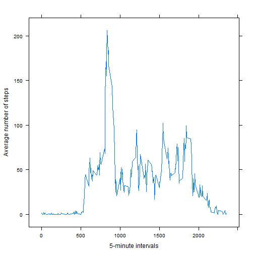
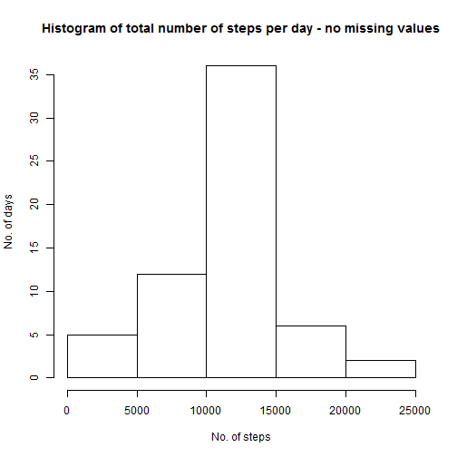

# Reproducible Research: Peer Assessment 1
### by trueskawka

## Loading and preprocessing the data

*Show any code that is needed to load the data (i.e. read.csv()), process/transform the data (if necessary) into a format suitable for your analysis.*


```r
setwd(choose.dir())
wd <- getwd()
data <- read.csv(paste(wd, "/activity.csv", sep=""))
```

```
## Warning: cannot open file
## 'C:/Users/JM/Documents/GitHub/RepData_PeerAssessment1/activity.csv': No
## such file or directory
```

```
## Error: cannot open the connection
```

## What is mean total number of steps taken per day?

**For this part of the assignment, you can ignore the missing values in the dataset.**

*Make a histogram of the total number of steps taken each day.*


```r
dat1 <- tapply(data$steps, data$date, sum, na.rm=T)
hist(dat1, xlab="No. of steps", ylab="No. of days", main="Histogram of total number of steps per day")
```

 

*Calculate and report the mean and median total number of steps taken per day.*


```r
m1 <- mean(dat1)
me1 <- median(dat1)
```

A. The mean total number of steps taken per day is 9354.2295 and the median is 10395.

## What is the average daily activity pattern?

*Make a time series plot (i.e. type = "l") of the 5-minute interval (x-axis) and the average number of steps taken, averaged across all days (y-axis).*


```r
library(lattice)
plot1 <- tapply(data$steps, data$interval, mean, na.rm=T)
xyplot(plot1~data$interval, type="l", ylab="Average number of steps", xlab="5-minute intervals")
```

 

*Which 5-minute interval, on average across all the days in the dataset, contains the maximum number of steps?*


```r
inter <- names(plot1[plot1 == max(plot1)])
```

A. The 5-minute interval containing the maximum number of steps on average across all the days in the dataset is 835.

## Imputing missing values

**Note that there are a number of days/intervals where there are missing values (coded as NA). The presence of missing days may introduce bias into some calculations or summaries of the data.**

*Calculate and report the total number of missing values in the dataset (i.e. the total number of rows with NAs).*


```r
nna <- sum(is.na(data$steps))
```

A. The total number of missing values in the dataset is 2304.

*Devise a strategy for filling in all of the missing values in the dataset. The strategy does not need to be sophisticated. For example, you could use the mean/median for that day, or the mean for that 5-minute interval, etc.*

A. The chosen strategy is the mean for the 5-minute interval across all the days in the dataset.


```r
#using the plot1 <- tapply(data$steps, data$interval, mean, na.rm=T), see below
```

*Create a new dataset that is equal to the original dataset but with the missing data filled in.*


```r
data2 <- data
data2$steps[is.na(data2$steps)] <- plot1[names(plot1) %in% data2$interval]
```

*Make a histogram of the total number of steps taken each day and calculate and report the mean and median total number of steps taken per day.*


```r
dat2 <- tapply(data2$steps, data2$date, sum, na.rm=T)
hist(dat2, xlab="No. of steps", ylab="No. of days", main="Histogram of total number of steps per day - no missing values")
```

 

```r
m2 <- mean(dat2)
me2 <- median(dat2)
```

A. The mean total number of steps taken per day is in the new dataset 1.0766 &times; 10<sup>4</sup> and the median is 1.0766 &times; 10<sup>4</sup>.

*Do these values differ from the estimates from the first part of the assignment? What is the impact of imputing missing data on the estimates of the total daily number of steps?*


```r
diffm <- m2 - m1
perm <- m1/m2

diffme <- me2 - me1
perme <- me1/me2
```

A. These values differ from the estimates from the first part.

The impact on mean is:
- difference between means 1411.9592,
- proportion between means 0.8689.

The impact on median is:
- difference between medians 371.1887,
- proportion between medians 0.9655.

Also, the new mean and median are the same - which suggests it's closer to a normal distribution.

## Are there differences in activity patterns between weekdays and weekends?

**For this part the weekdays() function may be of some help here. Use the dataset with the filled-in missing values for this part.**

*Create a new factor variable in the dataset with two levels – “weekday” and “weekend” indicating whether a given date is a weekday or weekend day.*


```r
#I'm from Poland, so I've changed it to English locale for this chunk
lct <- Sys.getlocale("LC_TIME"); Sys.setlocale("LC_TIME", "C")
```

```
## [1] "C"
```

```r
data2$date <- strptime(data2$date, format="%Y-%m-%d")

weekday <- c("Mon","Tue","Wed","Thu","Fri")
data2$days[weekdays(data2$date,abbreviate=T) %in% weekday] <- c("weekday")

weekend <- c("Sat","Sun")
data2$days[weekdays(data2$date,abbreviate=T) %in% weekend] <- c("weekend")

data2$days <- factor(data2$days, levels=c("weekday","weekend"))

Sys.setlocale("LC_TIME", lct)
```

```
## [1] "C"
```

*Make a panel plot containing a time series plot (i.e. type = "l") of the 5-minute interval (x-axis) and the average number of steps taken, averaged across all weekday days or weekend days (y-axis).* 


```r
data3 <- subset(data2, data2$days == "weekday")
data2$dt[data2$days == "weekday"] <- tapply(data3$steps, data3$interval, mean)

data4 <- subset(data2, data2$days == "weekend")
data2$dt[data2$days == "weekend"] <- tapply(data4$steps, data4$interval, mean)

xyplot(data2$dt~data2$interval|data2$days, type="l", layout=c(1,2))
```

 
